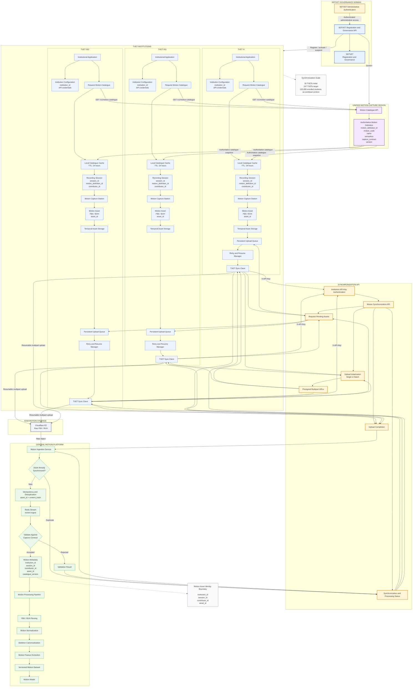

# Motion Ingestion High Level Architecture

```mermaid
flowchart TB

    %% ============================================================
    %% SDTVET GOVERNANCE & AUTHENTICATION
    %% ============================================================

    subgraph SDTVET_DOMAIN["SDTVET GOVERNANCE DOMAIN"]
        direction TB

        SDTVET_AUTH["SDTVET Administrative Authentication"]

        SDTVET_API["SDTVET Registration and Governance API"]

        SDTVET["SDTVET<br/>Registration and Governance"]

        SDTVET_AUTH -->|"Authenticated administrative access"| SDTVET_API
        SDTVET_API --> SDTVET
    end


    %% ============================================================
    %% TVET INSTITUTIONS
    %% ============================================================

    subgraph TVETS["TVET INSTITUTIONS<br/>Initial: 30 | Target: 247"]
        direction LR

        subgraph TVET1["TVET 001"]
            direction TB

            APP1["Institutional Application"]

            CONFIG1["Institution Configuration<br/>institution_id<br/>API credentials"]

            REQUEST1["Request Motion Catalogue"]

            CACHE1["Local Catalogue Cache<br/>TTL: 24 hours"]

            SESSION1["Recording Session<br/>session_id<br/>motion_definition_id<br/>contributor_id"]

            STATION1["Motion Capture Station"]

            ASSET1["Motion Asset<br/>FBX / BVH<br/>asset_id"]

            TEMP1["Temporal Asset Storage"]

            QUEUE1["Persistent Upload Queue"]

            RETRY1["Retry and Resume Manager"]

            SYNC1["TVET Sync Client"]

            APP1 --> CONFIG1
            APP1 --> REQUEST1
            REQUEST1 --> CACHE1
            CACHE1 --> SESSION1
            SESSION1 --> STATION1
            STATION1 --> ASSET1
            ASSET1 --> TEMP1
            TEMP1 --> QUEUE1
            QUEUE1 --> RETRY1
            RETRY1 --> SYNC1
        end


        subgraph TVET2["TVET 002"]
            direction TB

            APP2["Institutional Application"]

            CONFIG2["Institution Configuration<br/>institution_id<br/>API credentials"]

            REQUEST2["Request Motion Catalogue"]

            CACHE2["Local Catalogue Cache<br/>TTL: 24 hours"]

            SESSION2["Recording Session<br/>session_id<br/>motion_definition_id<br/>contributor_id"]

            STATION2["Motion Capture Station"]

            ASSET2["Motion Asset<br/>FBX / BVH<br/>asset_id"]

            TEMP2["Temporal Asset Storage"]

            QUEUE2["Persistent Upload Queue"]

            RETRY2["Retry and Resume Manager"]

            SYNC2["TVET Sync Client"]

            APP2 --> CONFIG2
            APP2 --> REQUEST2
            REQUEST2 --> CACHE2
            CACHE2 --> SESSION2
            SESSION2 --> STATION2
            STATION2 --> ASSET2
            ASSET2 --> TEMP2
            TEMP2 --> QUEUE2
            QUEUE2 --> RETRY2
            RETRY2 --> SYNC2
        end


        subgraph TVETN["TVET N"]
            direction TB

            APPN["Institutional Application"]

            CONFIGN["Institution Configuration<br/>institution_id<br/>API credentials"]

            REQUESTN["Request Motion Catalogue"]

            CACHEN["Local Catalogue Cache<br/>TTL: 24 hours"]

            SESSIONN["Recording Session<br/>session_id<br/>motion_definition_id<br/>contributor_id"]

            STATIONN["Motion Capture Station"]

            ASSETN["Motion Asset<br/>FBX / BVH<br/>asset_id"]

            TEMPN["Temporal Asset Storage"]

            QUEUEN["Persistent Upload Queue"]

            RETRYN["Retry and Resume Manager"]

            SYNCN["TVET Sync Client"]

            APPN --> CONFIGN
            APPN --> REQUESTN
            REQUESTN --> CACHEN
            CACHEN --> SESSIONN
            SESSIONN --> STATIONN
            STATIONN --> ASSETN
            ASSETN --> TEMPN
            TEMPN --> QUEUEN
            QUEUEN --> RETRYN
            RETRYN --> SYNCN
        end
    end


    %% ============================================================
    %% MOTION CATALOGUE
    %% ============================================================

    subgraph CATALOGUE["UNIFIED MOTION CAPTURE DESIGN"]
        direction TB

        CATALOG_API["Motion Catalogue API"]

        CATALOG_DEFINITION["Authoritative Motion Definition<br/>motion_definition_id<br/>motion_code<br/>name<br/>semantics<br/>capture_contract<br/>version"]

        CATALOG_API --> CATALOG_DEFINITION
    end


    %% ============================================================
    %% SYNCHRONIZATION API
    %% ============================================================

    subgraph SYNC_API["SYNCHRONIZATION API"]
        direction TB

        AUTH["Institution API-Key Authentication"]

        SYNC_ENDPOINT["Motion Synchronization API"]

        PENDING["Request Pending Assets"]

        INIT["Upload Initialization<br/>Single or Batch"]

        PRESIGNED["Presigned Multipart URLs"]

        COMPLETE["Upload Completion"]

        STATUS["Synchronization and Processing Status"]

        AUTH --> SYNC_ENDPOINT
        SYNC_ENDPOINT --> PENDING
        SYNC_ENDPOINT --> INIT
        INIT --> PRESIGNED
        SYNC_ENDPOINT --> COMPLETE
        SYNC_ENDPOINT --> STATUS
    end


    %% ============================================================
    %% RAW STORAGE
    %% ============================================================

    subgraph STORAGE["RAW MOTION STORAGE"]
        direction TB

        R2["Cloudflare R2<br/>Raw FBX / BVH"]
    end


    %% ============================================================
    %% CENTRAL MOTION PLATFORM
    %% ============================================================

    subgraph CENTRAL["CENTRAL MOTION PLATFORM"]
        direction TB

        INGEST["Motion Ingestion Service"]

        IDEMPOTENCY{"Asset Already<br/>Synchronized?"}

        DEDUP["Idempotency and Deduplication<br/>asset_id + content_hash"]

        STREAM["Redis Stream<br/>motion:ingest"]

        VALIDATE{"Validate Against<br/>Capture Contract"}

        QUALITY["Validation Result"]

        METADATA["Motion Metadata<br/>institution_id<br/>session_id<br/>contributor_id<br/>asset_id<br/>catalogue_version"]

        PROCESS["Motion Processing Pipeline"]

        PARSE["FBX / BVH Parsing"]

        NORMALIZE["Motion Normalization"]

        CANONICAL["Skeleton Canonicalization"]

        FEATURES["Motion Feature Extraction"]

        DATASET["Versioned Motion Dataset"]

        MODEL["Motion Model"]

        INGEST --> IDEMPOTENCY

        IDEMPOTENCY -->|"New"| DEDUP
        IDEMPOTENCY -->|"Duplicate"| STATUS

        DEDUP --> STREAM

        STREAM --> VALIDATE

        VALIDATE -->|"Accepted"| METADATA
        VALIDATE -->|"Rejected"| QUALITY

        METADATA --> PROCESS

        PROCESS --> PARSE
        PARSE --> NORMALIZE
        NORMALIZE --> CANONICAL
        CANONICAL --> FEATURES
        FEATURES --> DATASET
        DATASET --> MODEL
    end


    %% ============================================================
    %% SDTVET GOVERNANCE
    %% ============================================================

    SDTVET_API -->|"Register / activate / suspend"| TVETS

    SDTVET_API -->|"Govern"| CATALOGUE


    %% ============================================================
    %% CATALOGUE INTERACTION
    %% ============================================================

    REQUEST1 -->|"GET /v1/motion-catalogue"| CATALOG_API
    REQUEST2 -->|"GET /v1/motion-catalogue"| CATALOG_API
    REQUESTN -->|"GET /v1/motion-catalogue"| CATALOG_API

    CATALOG_DEFINITION -->|"Authoritative catalogue snapshot"| CACHE1
    CATALOG_DEFINITION -->|"Authoritative catalogue snapshot"| CACHE2
    CATALOG_DEFINITION -->|"Authoritative catalogue snapshot"| CACHEN


    %% ============================================================
    %% TVET AUTHENTICATION
    %% ============================================================

    SYNC1 -->|"X-API-Key"| AUTH
    SYNC2 -->|"X-API-Key"| AUTH
    SYNCN -->|"X-API-Key"| AUTH


    %% ============================================================
    %% INCREMENTAL SYNCHRONIZATION
    %% ============================================================

    SYNC1 --> PENDING
    SYNC2 --> PENDING
    SYNCN --> PENDING

    PENDING --> QUEUE1
    PENDING --> QUEUE2
    PENDING --> QUEUEN


    %% ============================================================
    %% UPLOAD INITIALIZATION
    %% ============================================================

    SYNC1 --> INIT
    SYNC2 --> INIT
    SYNCN --> INIT

    PRESIGNED --> SYNC1
    PRESIGNED --> SYNC2
    PRESIGNED --> SYNCN


    %% ============================================================
    %% RESUMABLE STORAGE UPLOAD
    %% ============================================================

    SYNC1 -->|"Resumable multipart upload"| R2
    SYNC2 -->|"Resumable multipart upload"| R2
    SYNCN -->|"Resumable multipart upload"| R2


    %% ============================================================
    %% COMPLETION AND INGESTION
    %% ============================================================

    SYNC1 --> COMPLETE
    SYNC2 --> COMPLETE
    SYNCN --> COMPLETE

    COMPLETE --> INGEST

    R2 -->|"Raw object"| INGEST


    %% ============================================================
    %% SYNCHRONIZATION RESULT
    %% ============================================================

    STATUS --> SYNC1
    STATUS --> SYNC2
    STATUS --> SYNCN

    QUALITY --> STATUS
    INGEST --> STATUS


    %% ============================================================
    %% IDENTITY BOUNDARY
    %% ============================================================

    IDENTITY["Motion Asset Identity Boundary<br/><br/>institution_id<br/>session_id<br/>contributor_id<br/>asset_id"]

    METADATA -.-> IDENTITY


    %% ============================================================
    %% SCALE
    %% ============================================================

    SCALE["Synchronization Scale<br/><br/>30 TVETs initial<br/>247 TVETs target<br/>130,000 enrolled students as workload context"]

    TVETS -.-> SCALE


    %% ============================================================
    %% STYLING
    %% ============================================================

    classDef governance fill:#E8F1FF,stroke:#2563EB,stroke-width:2px;
    classDef auth fill:#FFF4D6,stroke:#D97706,stroke-width:2px;
    classDef tvet fill:#EEF4FF,stroke:#2563EB,stroke-width:1px;
    classDef catalogue fill:#F3E8FF,stroke:#7C3AED,stroke-width:2px;
    classDef sync fill:#FFF4D6,stroke:#D97706,stroke-width:2px;
    classDef central fill:#EAF7EA,stroke:#16A34A,stroke-width:1px;
    classDef storage fill:#F1F5F9,stroke:#475569,stroke-width:2px;
    classDef context fill:#F8FAFC,stroke:#64748B,stroke-width:1px;

    class SDTVET,SDTVET_API governance;
    class SDTVET_AUTH,AUTH auth;

    class APP1,CONFIG1,REQUEST1,CACHE1,SESSION1,STATION1,ASSET1,TEMP1,QUEUE1,RETRY1,SYNC1 tvet;
    class APP2,CONFIG2,REQUEST2,CACHE2,SESSION2,STATION2,ASSET2,TEMP2,QUEUE2,RETRY2,SYNC2 tvet;
    class APPN,CONFIGN,REQUESTN,CACHEN,SESSIONN,STATIONN,ASSETN,TEMPN,QUEUEN,RETRYN,SYNCN tvet;

    class CATALOG_API,CATALOG_DEFINITION catalogue;

    class SYNC_ENDPOINT,PENDING,INIT,PRESIGNED,COMPLETE,STATUS sync;

    class INGEST,IDEMPOTENCY,DEDUP,STREAM,VALIDATE,QUALITY,METADATA,PROCESS,PARSE,NORMALIZE,CANONICAL,FEATURES,DATASET,MODEL central;

    class R2 storage;

    class IDENTITY,SCALE context;
```
